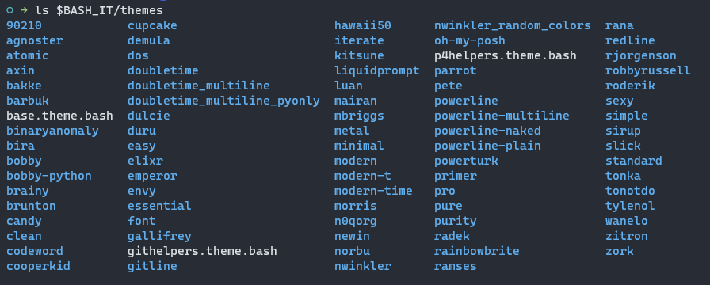
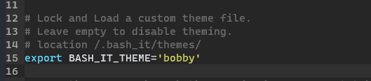
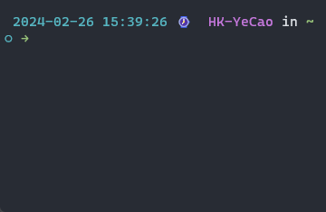
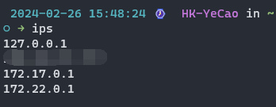
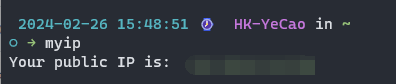
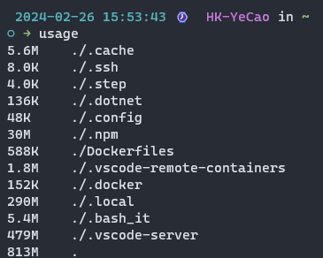

## 前言

原来一直都比较喜欢`zsh`和`on-my-zsh`，最近新开了一些 vps，不想每台都装一遍，虽然`zsh`颜值高，自动补全灵活，但是性能不是那么好

重新梳理了以下我对 shell 的需求：

- 颜值过得去
- 自动补全
- 性能好一些

最后找到了`bash-it`，用了几天，暂时满足当前需求。

</br>

---

## Bash-it 简介

![logo][logo-img]

![Linux][linux-img]
![shell][shell-img]
![License][license-img]

|          |                                             |
| -------- | ------------------------------------------- |
| 仓库地址 | <https://github.com/Bash-it/bash-it>        |
| 文档     | <https://bash-it.readthedocs.io/en/latest/> |
| License  | [MIT License][license-url]                  |

[logo-img]: https://github.com/Bash-it/media/raw/master/media/Bash-it.png
[linux-img]: https://img.shields.io/badge/Linux-black?logo=linux&logoColor=FCC624
[shell-img]: https://img.shields.io/badge/Shell-Bash-blue
[license-img]: https://img.shields.io/github/license/Bash-it/bash-it
[license-url]: https://github.com/Bash-it/bash-it/blob/master/LICENSE

---

`bash-it` 是一个社区的 bash 的框架，同时它也自带了许多的有用的别名、自动补全脚本、主题和插件。

如果你的 bash 配置很复杂，把它放在单个 `~/.bashrc` 就会显得很混乱，这种情况下就可以参照 `bash-it` 的规范对配置进行拆分。 `bash-it` 把所有的 bash 配置分成四个部分:

- 别名：放在 `$BASH_IT/aliases` 目录下
- 自动补全脚本：放在 `$BASH_IT/completion` 目录下
- 主题：放在 `$BASH_IT/themes` 目录下
- 其他配置信息：统一作为插件，放在 `$BASH_IT/plugins` 目录下

## 安装

```bash
git clone --depth=1 https://github.com/Bash-it/bash-it.git ~/.bash_it

~/.bash_it/install.sh
```

### 安装提示

```bash
~/.bash_it/install.sh
Installing bash-it
Backup file already exists. Make sure to backup your .bashrc before running this installation.
Would you like to overwrite the existing backup? This will delete your existing backup file (/root/.bashrc.bak) [y/N]
```

> 安装脚本会提示你是否保留原 .bashrc 的内容，如果输入 y 则会把 bash-it 的内容附加到原 .bashrc 文件后面，否则会直接用 bash-it 的内容替换 .bashrc 的内容。替换时 bash-it 会同时创建一个 .bashrc.bak 的备份文件以供还原。

### 重载 `~/.bashrc`

```bash
source ~/.bashrc
```

## 卸载

```bash
~/.bash_it/uninstall.sh

# 删除目录
rm -rf ~/.bash_it
```

## 更新

更新到最新的稳定版本

```bash
bash-it update stable
```

更新到最新的开发版本（从 master 更新）

```bash
bash-it update dev
```

## 使用

### 设置主题

默认主题为`bobby`，可以运行以下命令查看所有可用的主题

```bash
ls $BASH_IT/themes
```



主题截图可参照：<https://bash-it.readthedocs.io/en/latest/themes-list/#list-of-themes>

设置主题，修改 `.bashrc` 中 `export BASH_IT_THEME='bobby'` 为对应主题名即可



修改完成后记得重载

```bash
source ~/.bashrc
```

### 自动补全

```bash
# 查看自动补全情况
bash-it show completions
# 设置自动补全
bash-it enable completion defaults
bash-it enable completion system
bash-it enable completion bash-it
bash-it enable completion git
```

其他的用到再设置

### 插件

```bash
# 查看插件情况
bash-it show plugins
# 设置插件启用
bash-it enable plugin base
bash-it enable plugin sudo
```

#### sudo 插件

双击 `esc` 键，可在命令行前添加上 `sudo`
解决平时运行 `apt install` 命令时，忘了加 `sudo`，然后需要方向键移动到命令行前端的烦恼



#### base 插件

提供一些常用命令

具体参考 <https://github.com/Bash-it/bash-it/blob/master/plugins/available/base.plugin.bash>

> ips - 显示此主机的所有 IP 地址
>
> 

> myip - 显示互联网上的 IP 地址
>
> 

> usage - 显示每个目录的磁盘使用量、
>
> 
