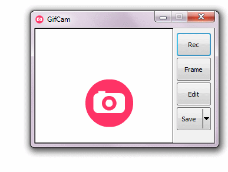

## GifCam 简介

![Windows][windows-img]
![License][license-img]

|          |                                                 |
| -------- | ----------------------------------------------- |
| 官网     | <https://blog.bahraniapps.com/gifcam/>          |
| 下载地址 | <https://blog.bahraniapps.com/gifcam/#download> |
| License  | 免费软件                                        |

[windows-img]: https://img.shields.io/badge/Windows-black?logo=windows&logoColor=0078D4
[license-img]: https://img.shields.io/badge/license-免费软件-0078D6

GifCam 是简单有趣的动画 GIF 制作应用程序.

它的界面简单易用，功能强大，支持多种录制模式和编辑选项，可以方便地制作高质量的 GIF 动画。

---

