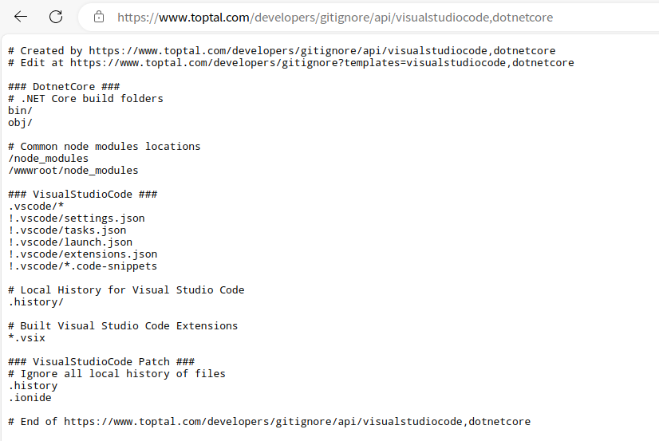
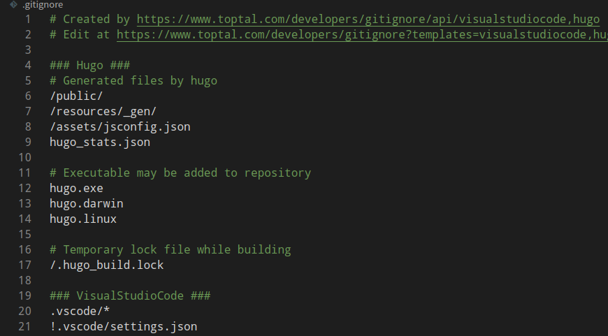

## 简介

[![][lang-img]][lang-url]
![Website][website-img]
![License][lic-img]

|         |                                               |
| ------- | --------------------------------------------- |
| 网站    | <https://gitignore.io>                        |
|         | <https://www.toptal.com/developers/gitignore> |
| 仓库    | <https://github.com/toptal/gitignore.io>      |
| 文档    | <https://docs.gitignore.io/>                  |
| License | [MIT License][lic-url]                        |

[lang-img]: https://img.shields.io/badge/Swift-4.1-orange.svg?style=flat-square
[lang-url]: https://swift.org
[website-img]: https://img.shields.io/website?url=https%3A%2F%2Fgitignore.io
[lic-img]: https://img.shields.io/github/license/toptal/gitignore.io
[lic-url]: https://github.com/toptal/gitignore.io/blob/master/LICENSE.md

---

## 使用

- 输入名称，回车或选中

  

- 点击创建

  

- 复制到你的 .gitignore 文件

  
