![logo][logo-img]

|      |                              |
| ---- | ---------------------------- |
| 网站 | <https://www.lightcdn.com/>  |
| 文档 | <https://docs.lightcdn.com/> |

[logo-img]: https://docs.lightcdn.com/static/logo.png

## 简介

LightCDN 是一个年轻的品牌。我们希望为客户提供最简单、最实惠、最有效的产品。

我们多年来一直致力于云计算行业。该公司成立于 2002 年，拥有 500 多名员工。

LightCDN 始终坚持“技术驱动的产品和运维驱动的服务”的理念。

## 免费月度计划

提供`免费月度计划`，用于个人非专业网站

- 免费的 SSL 证书
- 可自定义的 8 个核心国际节点
- 基础数据以及访客分析
- 无限的 HTTP(S) 请求


**免费月度计划 需要每月手工点击续期**


## CDN 节点

- 亚太地区
  - 香港，中国 （免费）
  - 东京，日本 （免费）
  - 新加坡，新加坡 （免费）
  - 曼谷，泰国
  - 马尼拉，菲律宾
  - 金边，柬埔寨
  - 河内，越南
  - 吉隆坡，马来西亚
  - 首尔，韩国
  - 达卡，孟加拉国
  - 台北，中国
  - 雅加达，印度尼西亚
- 中东地区
  - 迪拜，阿拉伯联合酋长国 （免费）
  - 马斯喀特，阿曼
  - 巴林，巴林
  - 利雅得，沙特阿拉伯
  - 伊斯坦布尔，土耳其
  - 科威特城，科威特
  - 吉达，沙特阿拉伯
- 非洲地区
  - 约翰内斯堡，南非
  - 开罗，埃及
- 欧洲地区
  - 马赛，法国
  - 伦敦，英国
  - 法兰克福，德国 （免费）
- 南美地区
  - 波哥大，哥伦比亚
  - 圣保罗，巴西 （免费）
- 北美地区
  - 硅谷，美国 （免费）
  - 华盛顿，美国 （免费）

## 定价



## 使用

### 1. 添加 CDN 资源

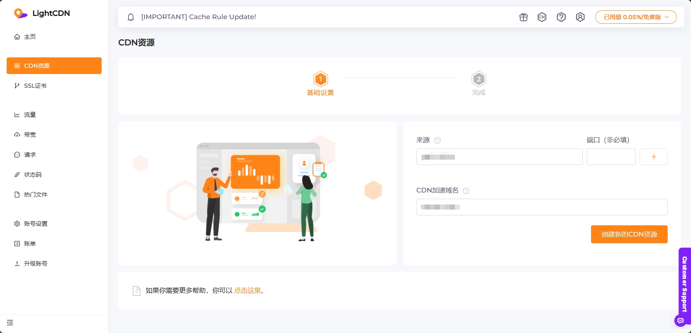

### 2. 设置 CDN 资源

#### 基础设置

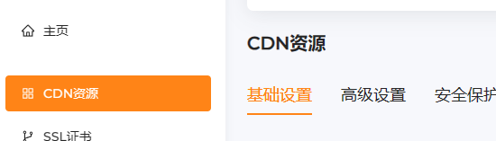

##### SSL

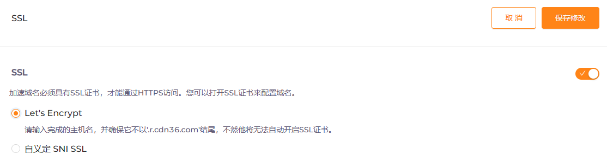



如果需要使用 `HTTPS`，启用他

如果自己有 SSL 证书，选择 `自定义`

如果没有 SSL 证书，选择 `Let's Encrypt`



#### 高级设置

##### 缓存过期时间

`缓存过期时间` 一般不需要修改，往下划

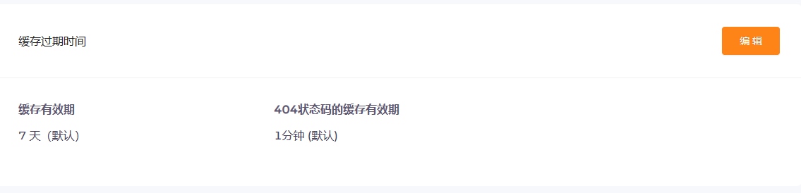

##### 来源政策

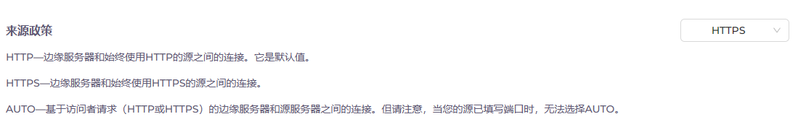



来源政策主要看源站是否启用了 `SSL`

如果启用了的话，就选 `HTTPS`

其他的建议 `HTTP` 或者 `AUTO`



##### CORS 标头

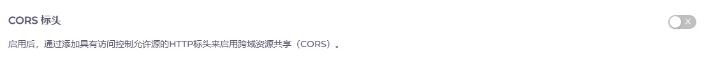



如果不是为了缓存 js、css 文件的话，建议关掉



##### 忽略 Set-Cookie

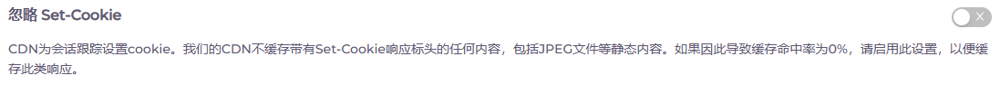



如果是静态资源（静态站点）的话，建议关掉

如果是动态 Blog，必须打开



#### 安全保护

##### 访问保护

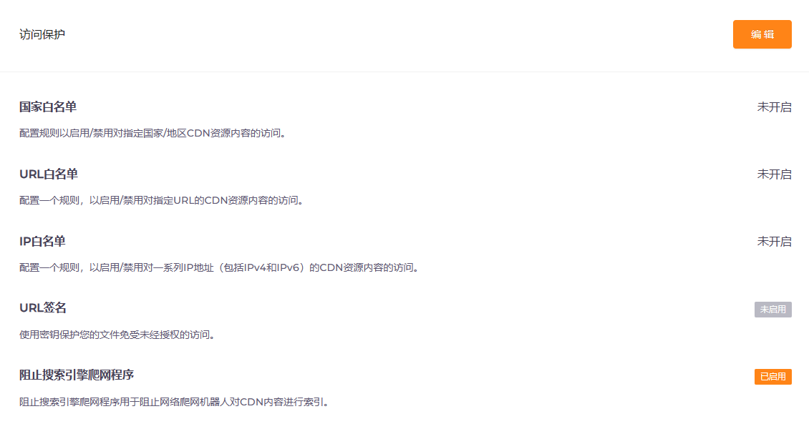



其他的按需设置

建议开启`阻止搜索引擎爬网程序`



#### 边缘位置

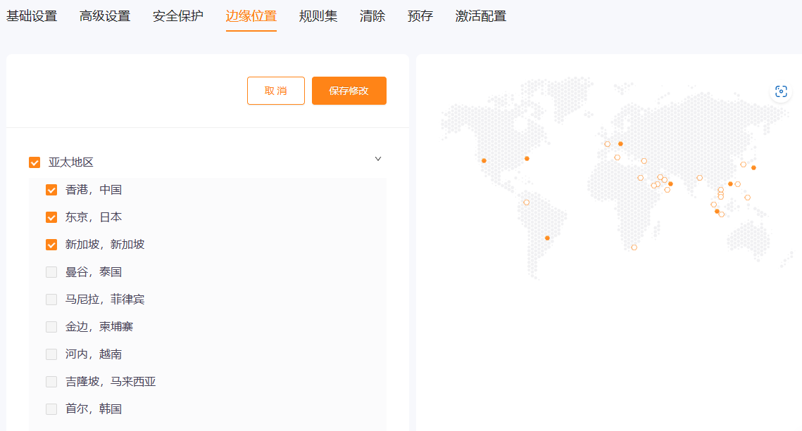



设置你需要的节点

可以看到 `免费计划` 中，亚太地区是可以使用 `中国香港` 节点的



---

#### 激活配置

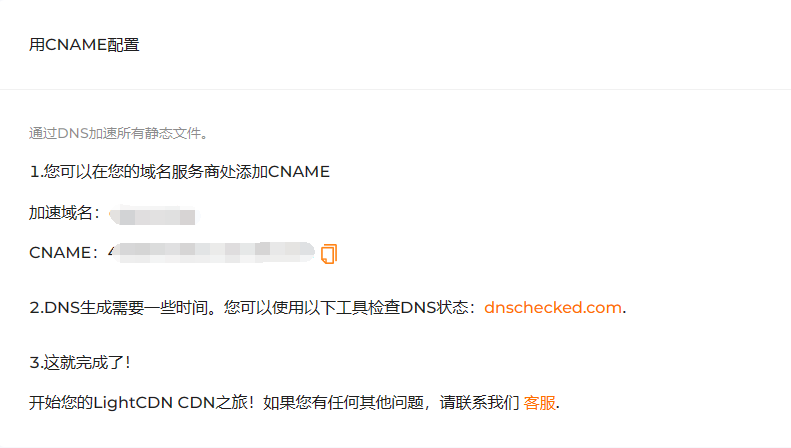



复制给出的 CNAME 地址，到你的 `域名服务商` 设置 `CNAME`



### 3. 查看流量情况

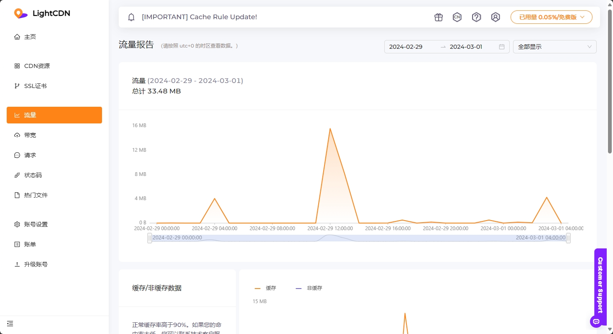

### 4. 查看带宽情况

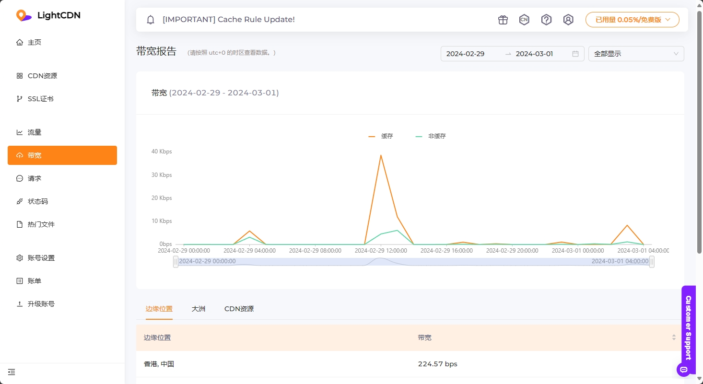
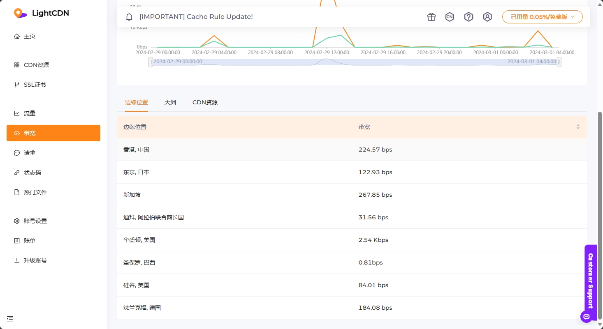

### 5. 查看请求命中情况

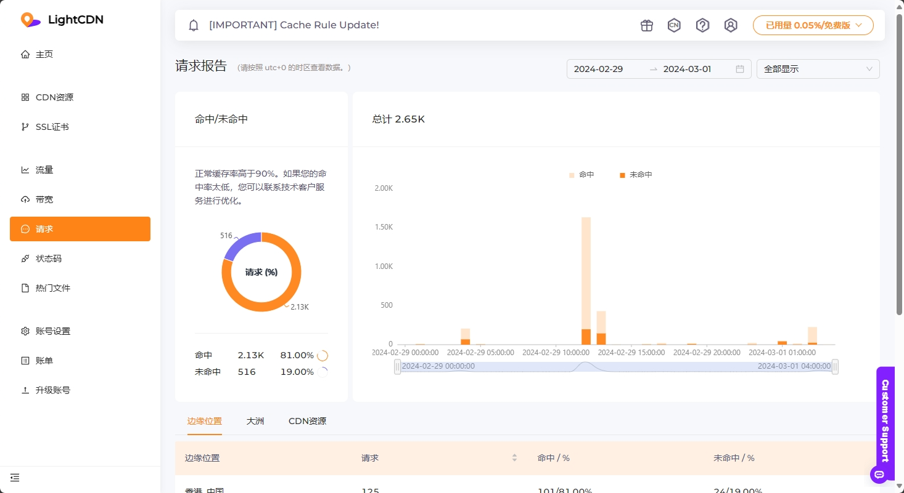



按 LightCDN 说法，一般请求命中率应该高于 90%


