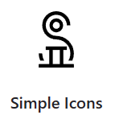
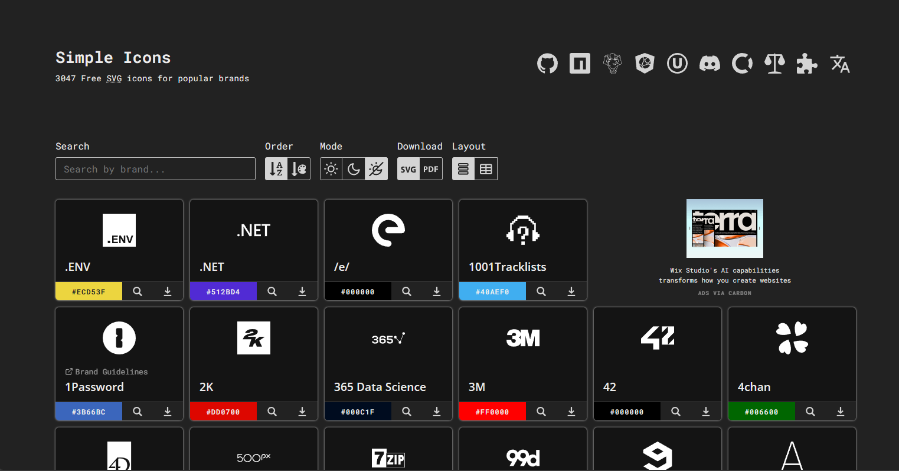

## Simple Icons 简介



[![Build status][buildstatus-img]][buildstatus-url]
[![NPM version][npm-img]][npm-url]
[![packagist][packagist-img]][packagist-url]
[![Number of icons currently in the library][icons-img]][icons-url]
![License][license-img]

|          |                                                |
| -------- | ---------------------------------------------- |
| 网站     | <https://simpleicons.org>                      |
| 仓库地址 | <https://github.com/simple-icons/simple-icons> |
| License  | [CC0 1.0 Universal][license-url]               |

[buildstatus-img]: https://img.shields.io/github/actions/workflow/status/simple-icons/simple-icons/verify.yml?branch=develop&logo=github&label=tests
[buildstatus-url]: https://github.com/simple-icons/simple-icons/actions?query=workflow%3AVerify+branch%3Adevelop
[npm-img]: https://img.shields.io/npm/v/simple-icons.svg?logo=npm
[npm-url]: https://www.npmjs.com/package/simple-icons
[packagist-img]: https://img.shields.io/packagist/v/simple-icons/simple-icons?logo=packagist&logoColor=white
[packagist-url]: https://packagist.org/packages/simple-icons/simple-icons
[icons-img]: https://img.shields.io/badge/dynamic/json?color=informational&label=icons&prefix=%20&logo=simpleicons&query=%24.icons.length&url=https%3A%2F%2Fraw.githubusercontent.com%2Fsimple-icons%2Fsimple-icons%2Fdevelop%2F_data%2Fsimple-icons.json
[icons-url]: https://simpleicons.org
[license-img]: https://img.shields.io/github/license/simple-icons/simple-icons
[license-url]: https://github.com/simple-icons/simple-icons/blob/develop/LICENSE.md

超过 3000 个流行品牌的免费 SVG 图标，可以网站上直接下载，无需注册。

---

## 网站截图



## 使用

### 一般用法

<https://simpleicons.org>

进入网站，搜索需要的 Icons，点击下载即可

### Node 用法

图标可以从 npm 中获取

安装 npm 包

```bash
npm install simple-icons
```

```js
// Import a specific icon by its slug as:
// import { si[ICON SLUG] } from 'simple-icons'

// For example:
// use import/esm to allow tree shaking
import { siSimpleicons } from "simple-icons";
// or with require/cjs
const { siSimpleicons } = require("simple-icons");
```

将返回一个 icon 对象

```ts
console.log(siSimpleicons);

/*
{
    title: 'Simple Icons',
    slug: 'simpleicons',
    hex: '111111',
    source: 'https://simpleicons.org/',
    svg: '<svg role="img" viewBox="0 0 24 24" xmlns="http://www.w3.org/2000/svg">...</svg>',
    path: 'M12 12v-1.5c-2.484 ...',
    guidelines: 'https://simpleicons.org/styleguide',
    license: {
        type: '...',
        url: 'https://example.com/'
    }
}

NOTE: the `guidelines` entry will be `undefined` if we do not yet have guidelines for the icon.
NOTE: the `license` entry will be `undefined` if we do not yet have license data for the icon.
*/
```

如果需要遍历所有 icons

```js
import * as icons from "simple-icons";
```

### TypeScript 用法

```ts
import type { SimpleIcon } from "simple-icons";
```

### 其他用法

[用法参考](https://github.com/simple-icons/simple-icons/blob/develop/README.md)
