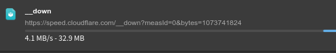
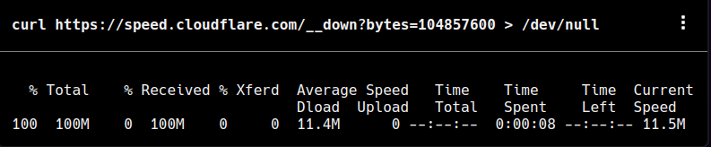
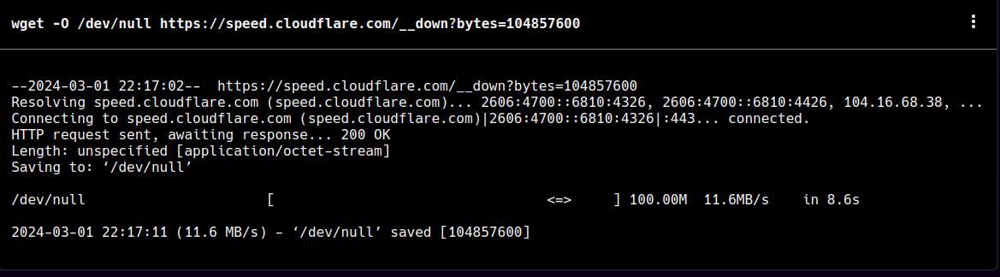

**speed.cloudflare.com** 是一个由 Cloudflare 提供的网络性能测试工具



详细介绍可查阅这篇文章: [《speed.cloudflare.com - Cloudflare 提供的网络测试工具》](../../s/speed.cloudflare.com/)



除了进行网页测速以外，我们还可以使用 `https://speed.cloudflare.com/__down` 来生成自定义大小的文件进行下载测速

## URL 格式

```
https://speed.cloudflare.com/__down?bytes=<自定义文件大小>
```

## 示例

|                |                                                         |
| -------------- | ------------------------------------------------------- |
| [10MB][10MB]   | `https://speed.cloudflare.com/__down?bytes=10485760`    |
| [50MB][50MB]   | `https://speed.cloudflare.com/__down?bytes=52428800`    |
| [100MB][100MB] | `https://speed.cloudflare.com/__down?bytes=104857600`   |
| [500MB][500MB] | `https://speed.cloudflare.com/__down?bytes=524288000`   |
| [1GB][1GB]     | `https://speed.cloudflare.com/__down?bytes=1073741824`  |
| [2GB][2GB]     | `https://speed.cloudflare.com/__down?bytes=2147483648`  |
| [10GB][10GB]   | `https://speed.cloudflare.com/__down?bytes=10737418240` |

[10MB]: https://speed.cloudflare.com/__down?bytes=10485760
[50MB]: https://speed.cloudflare.com/__down?bytes=52428800
[100MB]: https://speed.cloudflare.com/__down?bytes=104857600
[500MB]: https://speed.cloudflare.com/__down?bytes=524288000
[1GB]: https://speed.cloudflare.com/__down?bytes=1073741824
[2GB]: https://speed.cloudflare.com/__down?bytes=2147483648
[10GB]: https://speed.cloudflare.com/__down?bytes=10737418240

## 测试



也可以用 `curl` `wget` 等命令进行测试

```bash {title="100MB"}
curl https://speed.cloudflare.com/__down?bytes=104857600 > /dev/null
```



```bash {title="100MB"}
wget -O /dev/null https://speed.cloudflare.com/__down?bytes=104857600
```


