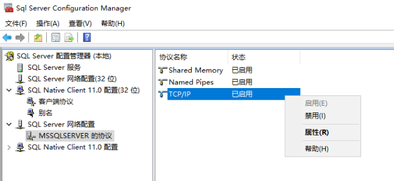
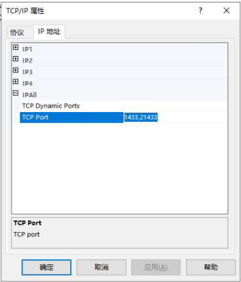
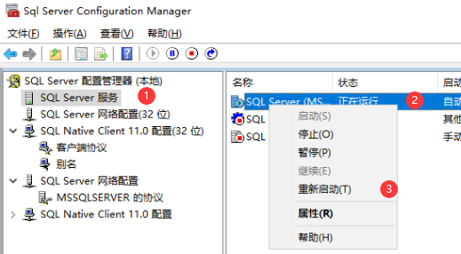


**本主题说明如何使用 SQL Server 配置管理器在 数据库引擎 中将 SQL Server 配置为侦听多个 TCP 端口。**


## 步骤

### 1. 打开`SQL Server 配置管理器`

打开 `SQL Server 配置管理器`，展开 `SQL Server 网络配置`，找到 <实例> 协议 `TCP/IP`，右键属性

### 2. 修改监听端口

打开 `IP 地址` - `IPALL`，在 `TCP Ports` 中，输入需要监听的端口


多个端口，用逗号隔开

例如：`1433,21433`


### 3. 重启服务

`SQL Server 配置管理器` 中，找到 `SQL Server 服务`，找到实例，右键重启

## 参考


